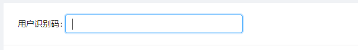

<h2 align="center">refs 自动获取 input 框焦点记录</h2>

### 效果图
 

### 实现代码
```
componentDidMount = () => {
  // 用 ref 自动获取输入框焦点
  const { input } = this.refInput;
  input.focus();
}


<Input
  ref={input => { this.refInput = input }}
  style={{ width: 300 }}
/>
```